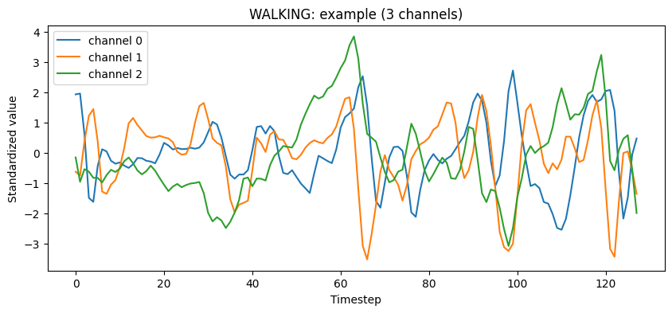
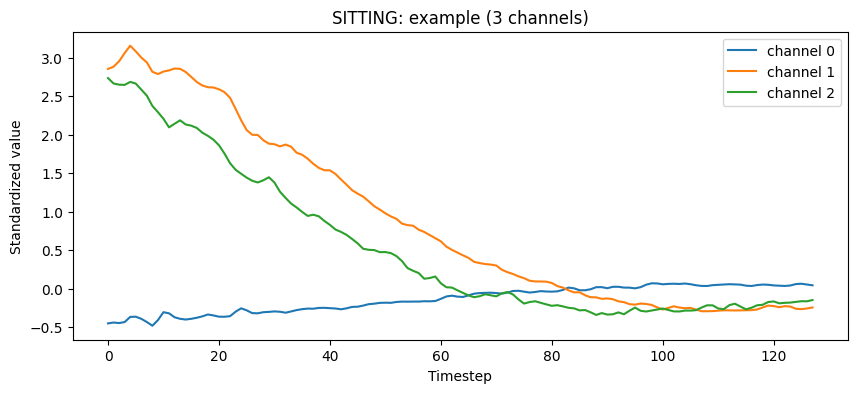
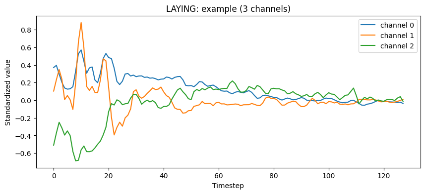
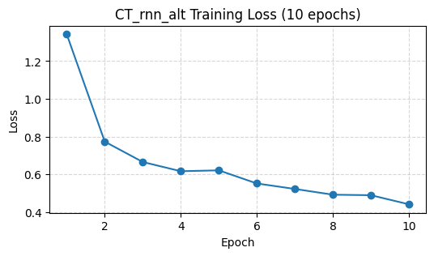
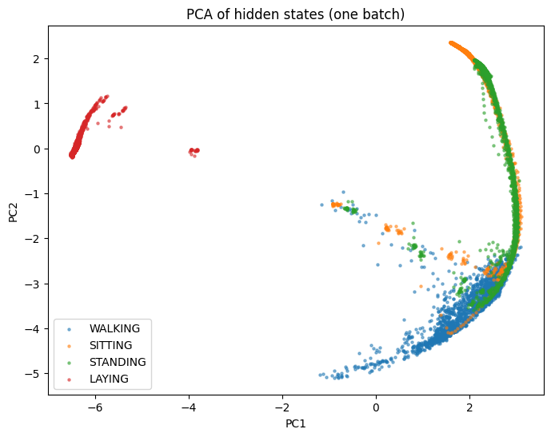
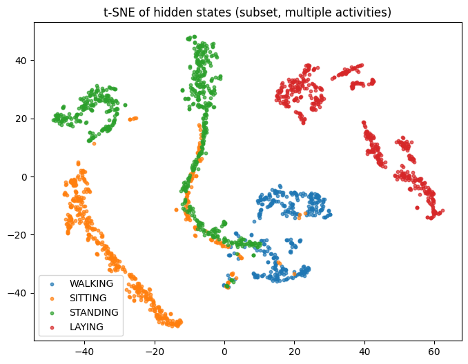
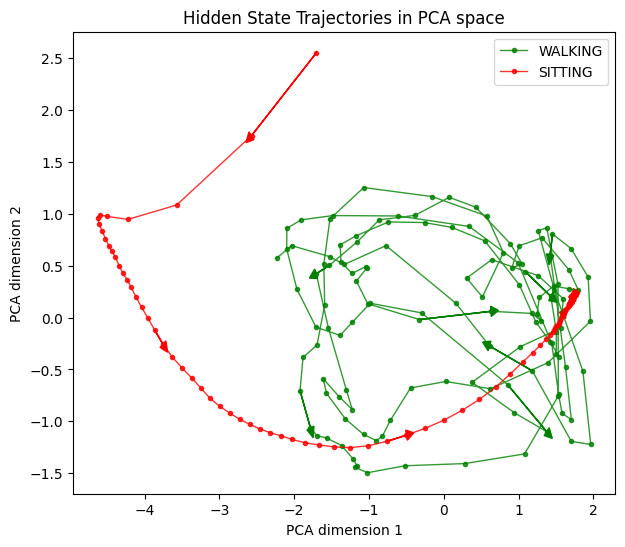
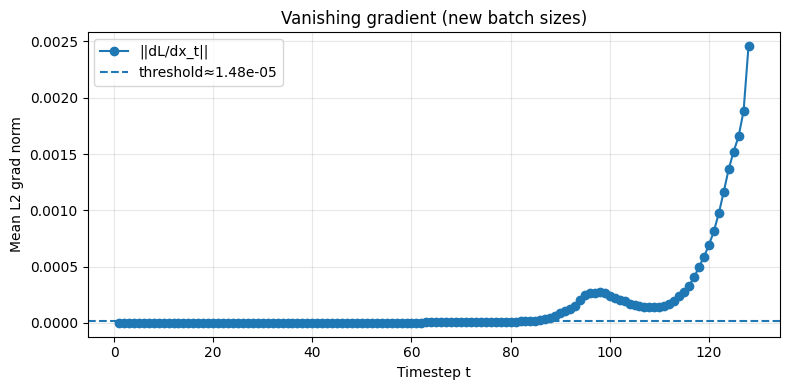

# Understanding and Visualizing RNNs for Human Activity Recognition

This project provides a step-by-step guide to understanding, building, training, and diagnosing a vanilla Recurrent Neural Network (RNN) for a time-series classification task. Using the popular UCI Human Activity Recognition (HAR) dataset, we explore the mechanics of RNNs, visualize their internal states, and analyze their limitations.

## Project Overview

The goal is to classify human activities (like Walking, Sitting, Standing) based on smartphone sensor data (accelerometer and gyroscope). This project is broken down into four sequential notebooks that take you from the fundamentals of sequence modeling to the practical diagnosis of common RNN failure modes.


### Key Concepts Covered

*   **Sequence Modeling**: Understanding temporal and sequential data.
*   **Recurrent Neural Networks (RNNs)**: Exploring the core mechanics of how RNNs process sequences and maintain memory.
*   **Human Activity Recognition (HAR)**: A practical application of time-series classification.
*   **Data Preprocessing**: Loading, standardizing, and batching multivariate time-series data for deep learning models.
*   **PyTorch Implementation**: Building, training, and evaluating an RNN classifier from scratch.
*   **Model Interpretation**: Visualizing hidden states with dimensionality reduction techniques like **PCA** and **t-SNE** to "open the black box".
*   **Diagnosing Model Failures**: Empirically demonstrating the **vanishing gradient problem** and performing detailed per-class error analysis.

## Dataset

This project uses the **UCI Human Activity Recognition Using Smartphones Dataset**.

*   **Source**: [UCI Machine Learning Repository](https://archive.ics.uci.edu/ml/datasets/human+activity+recognition+using+smartphones)
*   **Kaggle Link**: [UCI HAR Dataset on Kaggle](https://www.kaggle.com/datasets/drsaeedmohsen/ucihar-dataset/data)

The dataset consists of sensor readings (accelerometer and gyroscope) from a waist-mounted smartphone, collected as 30 volunteers performed six activities. The data is pre-processed into fixed-length windows of 2.56 seconds (128 timesteps), with each timestep containing 9 features.

## Project Structure & Notebooks

This project is structured as a series of four Jupyter notebooks, designed to be followed in order.

###  Notebook 1: `01_Exploring_the_HAR_Dataset_&_Understanding_RNNs.ipynb`

This notebook lays the groundwork for the entire project.

*   **Introduces** the concept of sequential data and the structure of the HAR dataset.
*   **Explores** the mechanics of RNNs through hands-on case studies with varying batch sizes and hidden dimensions.
*   **Teaches** how to prepare and shape data tensors for PyTorch's RNN layers, including the difference between `batch-first` and `time-first` formats.
*   **Visualizes** sample activity sequences to build intuition about the underlying patterns.

  

###  Notebook 2: `02_Training_a_Vanilla_RNN_for_Activity_Recognition.ipynb`

This notebook moves from theory to practice by building and training a complete classifier.

*   **Implements** a self-contained data preprocessing pipeline and saves the standardized dataset as `.npy` and `.csv` files for future use.
*   **Defines** a vanilla `RNNClassifier` in PyTorch.
*   **Builds** a full training and evaluation loop with a loss function, optimizer, and accuracy tracking.
*   **Evaluates** the trained model on the test set, generating a **confusion matrix** and a classification report to analyze performance.
*   **Discusses** the theoretical limitations of vanilla RNNs, such as the vanishing gradient problem.



###  Notebook 3: `03_Visualizing_Hidden_States_&_Temporal_Representation.ipynb`

Here, we "open the black box" to understand what the RNN has learned internally.

*   **Reloads** the preprocessed dataset and the trained model from Notebook 2.
*   **Extracts and visualizes** the hidden state trajectories (`h_t`) over 128 timesteps for different activities.
*   **Applies PCA and t-SNE** to project the high-dimensional hidden states into a 2D space, revealing how the model clusters and separates activities.
*   **Plots** the temporal paths of sequences in the reduced space to show how the RNN's memory "moves" as it processes an activity.

  

###  Notebook 4: `04_What_the_RNN_Learns_vs_Where_it_Fails.ipynb`

The final notebook focuses on diagnosing the specific failure modes of our vanilla RNN.

*   **Empirically demonstrates** the **vanishing gradient problem** by plotting the magnitude of gradients with respect to input timesteps.
*   **Performs** a detailed per-class error analysis to identify which activities are most commonly confused (e.g., *Walking* vs. *Walking Upstairs*).
*   **Visualizes** the raw sensor signals for misclassified examples to understand why the model struggles.
*   **Motivates** the need for more advanced architectures like LSTMs and GRUs, which are designed to overcome these limitations.



## Setup and Installation

1.  **Clone the repository:**
    ```bash
    git clone https://github.com/Extroverted-introvert/RNN-HAR-Visualization
    cd RNN-HAR-Visualization
    ```

2.  **Download the dataset:**
    *   Download the dataset from the [Kaggle link](https://www.kaggle.com/datasets/drsaeedmohsen/ucihar-dataset/data).
    *   Extract the contents and ensure the `UCI HAR Dataset` folder is in the root directory of this project.

3.  **Install the required libraries:**
    It is recommended to use a virtual environment.
    ```bash
    pip install -r requirements.txt
    ```
    
## How to Run

The notebooks are designed to be run sequentially, as each one builds upon the data or models generated by the previous one.

1.  **`01_Exploring_the_HAR_Dataset_&_Understanding_RNNs.ipynb`**: Run this first to understand the data and RNN mechanics.
2.  **`02_Training_a_Vanilla_RNN_for_Activity_Recognition.ipynb`**: This will train the model and save the following important files:
    *   `har_train_standardized.csv` / `har_test_standardized.csv` (Processed data)
    *   `X_train_std.npy` / `X_test_std.npy` (Alternative fast-loading data)
    *   `rnn_har.pth` (Trained model weights)
3.  **`03_Visualizing_Hidden_States_&_Temporal_Representation.ipynb`**: This notebook loads `rnn_har.pth` and the processed data to create visualizations.
4.  **`04_What_the_RNN_Learns_vs_Where_it_Fails.ipynb`**: This notebook also loads the saved model and data to diagnose its limitations.
